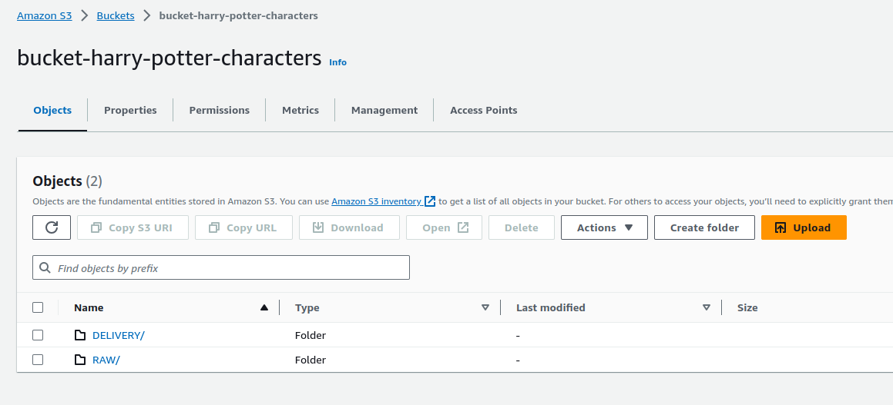
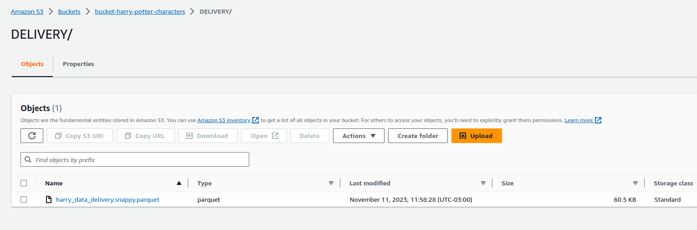
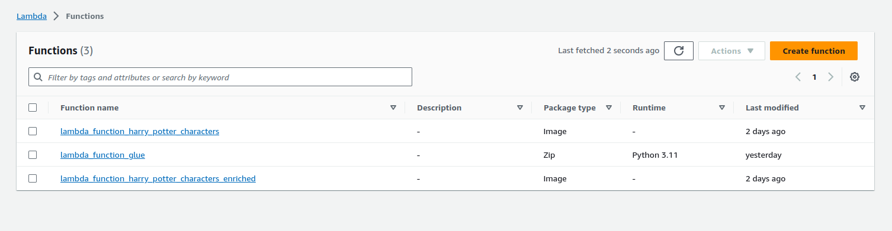
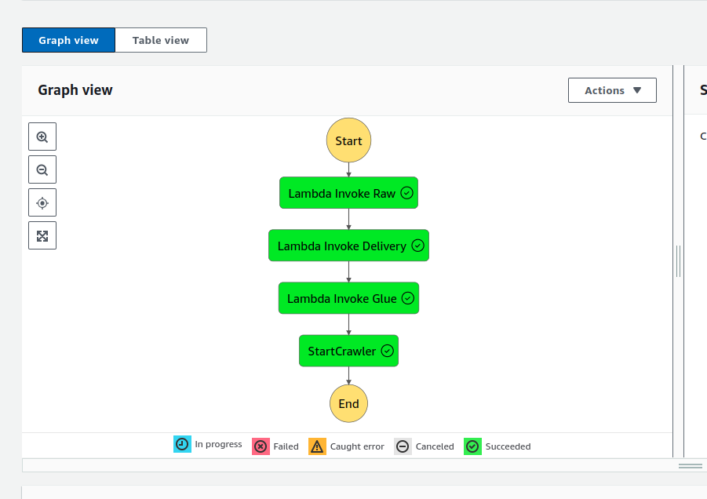
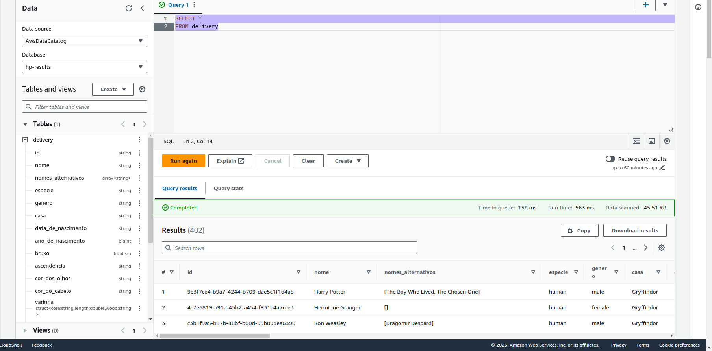

## Pipeline de Dados abertos sobre Harry Potter

Olá!

Esse projeto de ETL na AWS, trata de ponta a ponta uma pipeline de dados abertos sobre Harry Potter, relacionados aos personagens e curiosidades, como idade, descrição de sua varinha e muito mais, com o uso de Pandas, Requests, AwsWrangler, Boto3!

Lista de ferramentas utilizadas:

## AWS Tools
- Athena
- ECR
- Glue Crawler
- Glue Database
- Lambda Function
- S3
- Step Functions
- IAM

## LAMBDA_RAW

Vamos entender o que esta lambda function está fazendo. Essa função Lambda está realizando uma requisição na API de Harry Potter e, com as informações obtidas nessa solicitação, estamos convertendo para um dataframe e salvando no S3 dentro do nosso bucket, na zona RAW, no formato parquet.

```python
import requests
import pandas as pd
import awswrangler as wr

# pd.set_option('display.max_rows', 500)
# pd.set_option('display.max_columns', 500)
# pd.set_option('display.width', 1000)

BUCKET_NAME = 'bucket-harry-potter-characters'

def get_data():

    url = 'https://hp-api.onrender.com/api/characters'
    data_list = []

    while url:
        r = requests.get(url)
        data = r.json()
        data_list.extend(data)
        url = r.links.get('next', {}).get('url')

    df = pd.DataFrame(data_list)
    df.columns = df.columns.str.upper()
    return df

def save_characters_s3(bucket_name, df):

    return wr.s3.to_parquet(
        df=df,
        path=f's3://{bucket_name}/RAW/harry_data_characters.snappy.parquet'
    )

def lambda_handler(event=None, context=None):

    df = get_data()

    save_characters_s3(BUCKET_NAME, df)
    print('Executado com Sucesso')
```
## LAMBDA_DELIVERY

Nesta outra função, estamos lendo as informações que foram salvas na RAW  e após a leitura, realizamos transformações simples, como a alteração dos nomes das colunas do inglês para o português e, em seguida, enriquecemos o dataframe adicionando colunas adicionais com informações já existente nos dados. Por fim, salvamos os dados enriquecidos novamente no S3, na zona, DELIVERY.

```python
import pandas as pd
import awswrangler as wr
import boto3

#pd.set_option('display.max_rows', 500)
#pd.set_option('display.max_columns', 500)
#pd.set_option('display.width', 1000)

BUCKET_NAME = 'bucket-harry-potter-characters'

def change_columns_name_to_pt_br(df):

    colunas_em_portugues = {
        "ID": "ID",
        "NAME": "NOME",
        "ALTERNATE_NAMES": "NOMES_ALTERNATIVOS",
        "SPECIES": "ESPECIE",
        "GENDER": "GENERO",
        "HOUSE": "CASA",
        "DATEOFBIRTH": "DATA_DE_NASCIMENTO",
        "YEAROFBIRTH": "ANO_DE_NASCIMENTO",
        "WIZARD": "BRUXO",
        "ANCESTRY": "ASCENDENCIA",
        "EYECOLOUR": "COR_DOS_OLHOS",
        "HAIRCOLOUR": "COR_DO_CABELO",
        "WAND": "VARINHA",
        "PATRONUS": "PATRONO",
        "HOGWARTSSTUDENT": "ESTUDANTE_DE_HOGWARTS",
        "HOGWARTSSTAFF": "EQUIPE_DE_HOGWARTS",
        "ACTOR": "ATOR",
        "ALTERNATE_ACTORS": "ATORES_ALTERNATIVOS",
        "ALIVE": "VIVO",
        "IMAGE": "IMAGEM"
    }

    df.rename(columns=colunas_em_portugues, inplace=True)
    return df
    
def enriquecer_dataframe(df):

    df["ANO_DE_NASCIMENTO"] = df["ANO_DE_NASCIMENTO"].fillna(0).astype(int)

    df['IDADE'] = df.apply(lambda row: 2023 - row['ANO_DE_NASCIMENTO'] if row['ANO_DE_NASCIMENTO'] != 0 else None, axis=1)
    df['IDADE'] = df["IDADE"].fillna(0).astype(int)

    df["DATA_DE_NASCIMENTO"] = df["DATA_DE_NASCIMENTO"].fillna("")
    df["DATA_DE_NASCIMENTO"] = pd.to_datetime(df["DATA_DE_NASCIMENTO"])
    df["DATA_DE_NASCIMENTO"] = df["DATA_DE_NASCIMENTO"].astype(str).replace('NaT', '')

    df["DESCRICAO_PERSONAGEM"] = df["NOME"] + " é um bruxo " + df["ESPECIE"] + " da casa " + df["CASA"] + " em Hogwarts."

    df['DESCRICAO_VARINHA'] = df['VARINHA'].apply(lambda x: f"A varinha tem um núcleo de {x['core']} com {x['length']} polegadas de comprimento e é feita de madeira de {x['wood']}." if x and x.get('core') and x.get('length') and x.get('wood') else "Descrição não disponível")

    df["DESCRICAO_PATRONUS"] = "O Patronus de " + df["NOME"] + " assume a forma de um(a) " + df["PATRONO"] + "."

    return df

def save_enriched_characters(bucket_name, df):

    return wr.s3.to_parquet(
        df=df,
        path=f's3://{bucket_name}/DELIVERY/harry_data_delivery.snappy.parquet'
    )

def lambda_handler(event=None, context=None):

    df = wr.s3.read_parquet(f's3://{BUCKET_NAME}/RAW/harry_data_characters.snappy.parquet')

    df = change_columns_name_to_pt_br(df)

    df = enriquecer_dataframe(df)

    save_enriched_characters(BUCKET_NAME, df)
    print('Executado com Sucesso')
```
## LAMBDA_GLUE

E por fim, estamos fazendo uma verificação para ver se o database no glue já é existente, se não, será criado o recurso. Após a criação do mesmo, é executada a criação do Crawler para que seja possível criar no Athena uma tabela para realizar consultas SQL dentro do Athena, seguindo a mesma lógica de criação do glue database.

```python
import boto3

CRAWLER_NAME = 'crawler_harry'
S3_TARGET = 's3://bucket-harry-potter-characters/DELIVERY/'
DATABASE_NAME = 'hp-results'
REGION_NAME = 'us-east-1'

def create_glue_database(database_name, region_name):
    glue_client = boto3.client('glue', region_name=region_name)
    
    try:
        response = glue_client.create_database(
            DatabaseInput={'Name': database_name}
        )
        print(f'Banco de dados "{database_name}" criado com sucesso no AWS Glue Data Catalog.')
    except Exception:
        print(f'A database "{database_name}" já existe.')

def create_glue_crawler(crawler_name, database_name, s3_target, region_name):
    glue_client = boto3.client('glue', region_name=region_name)
    
    try:
        response = glue_client.create_crawler(
            Name=crawler_name,
            Role='arn:aws:iam::XXXXXXXXX:role/glue-crawler-role', 
            DatabaseName=database_name,
            Targets={'S3Targets': [{'Path': s3_target}]}
        )
        print(f'Crawler "{crawler_name}" criado com sucesso no AWS Glue.')
    except glue_client.exceptions.AlreadyExistsException:
        print(f'O crawler "{crawler_name}" já existe.')
    except Exception as e:
        print(f'Erro ao criar o crawler: {str(e)}')

def lambda_handler(event=None, context=None):

    create_glue_database(DATABASE_NAME, REGION_NAME)

    create_glue_crawler(CRAWLER_NAME, DATABASE_NAME, S3_TARGET, REGION_NAME)

    print('Executado com Sucesso')


```

## STEP_FUNCTION

A orquestração é realizada ondemand via StepFunction, ao invés de ferramentas como Airflow. Nesse caso estamos triggando nossas lambdas function acima, uma após a outra e por fim, triggando o crawler, também ondemand, para disponbilizar o recurso no Athena.

```json
{
    "Comment": "A description of my state machine",
    "StartAt": "Lambda Invoke Raw",
    "States": {
      "Lambda Invoke Raw": {
        "Type": "Task",
        "Resource": "arn:aws:states:::lambda:invoke",
        "OutputPath": "$.Payload",
        "Parameters": {
          "FunctionName": "arn:aws:lambda:us-east-1:XXXXXXXXXXX:function:lambda_function_harry_potter_characters:$LATEST"
        },
        "Retry": [
          {
            "ErrorEquals": [
              "Lambda.ServiceException",
              "Lambda.AWSLambdaException",
              "Lambda.SdkClientException",
              "Lambda.TooManyRequestsException"
            ],
            "IntervalSeconds": 1,
            "MaxAttempts": 3,
            "BackoffRate": 2
          }
        ],
        "Next": "Lambda Invoke Delivery"
      },
      "Lambda Invoke Delivery": {
        "Type": "Task",
        "Resource": "arn:aws:states:::lambda:invoke",
        "OutputPath": "$.Payload",
        "Parameters": {
          "FunctionName": "arn:aws:lambda:us-east-1:XXXXXXXXXXX:function:lambda_function_harry_potter_characters_enriched:$LATEST"
        },
        "Retry": [
          {
            "ErrorEquals": [
              "Lambda.ServiceException",
              "Lambda.AWSLambdaException",
              "Lambda.SdkClientException",
              "Lambda.TooManyRequestsException"
            ],
            "IntervalSeconds": 1,
            "MaxAttempts": 3,
            "BackoffRate": 2
          }
        ],
        "Next": "Lambda Invoke Glue"
      },
      "Lambda Invoke Glue": {
        "Type": "Task",
        "Resource": "arn:aws:states:::lambda:invoke",
        "OutputPath": "$.Payload",
        "Parameters": {
          "FunctionName": "arn:aws:lambda:us-east-1:XXXXXXXXXXX:function:lambda_function_glue:$LATEST"
        },
        "Retry": [
          {
            "ErrorEquals": [
              "Lambda.ServiceException",
              "Lambda.AWSLambdaException",
              "Lambda.SdkClientException",
              "Lambda.TooManyRequestsException"
            ],
            "IntervalSeconds": 1,
            "MaxAttempts": 3,
            "BackoffRate": 2
          }
        ],
        "Next": "StartCrawler"
      },
      "StartCrawler": {
        "Type": "Task",
        "Parameters": {
          "Name": "crawler_harry"
        },
        "Resource": "arn:aws:states:::aws-sdk:glue:startCrawler",
        "End": true
      }
    }
  }
```

### Recursos Criados

#### Dados no Bucket (Lake)




#### Lambdas



#### StepFunction



#### Athena



## Acesso aos códigos e estruturas gerais

- [lambda_raw](https://github.com/HenriqueDePaula12/harrypotter-aws/blob/master/lambda_raw)
- [lambda_delivery](https://github.com/HenriqueDePaula12/harrypotter-aws/blob/master/lambda_delivery)
- [lambda_glue](https://github.com/HenriqueDePaula12/harrypotter-aws/blob/master/lambda_glue)
- Os dados brutos podem ser obtidos a partir deste [link](https://hp-api.onrender.com/api/characters).

## Observações

Configurar o projeto com suas respectivas informações :D
